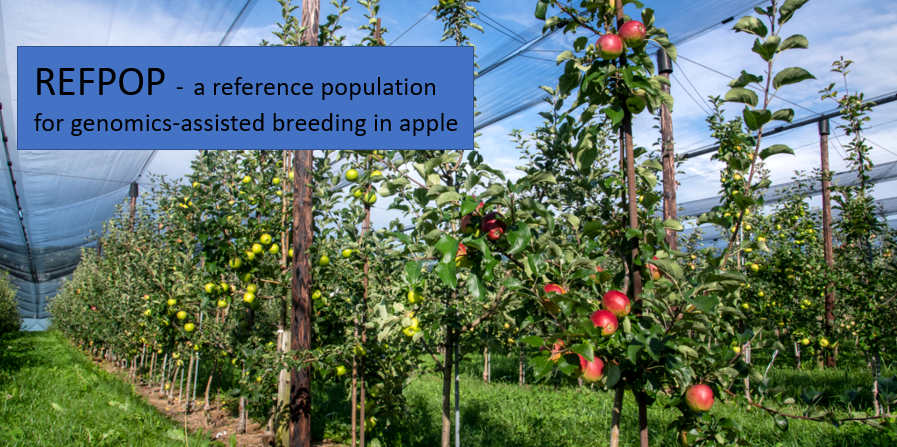

# refpop
This repository contains the refpop R scripts, for achieving reproducible data analysis and results, according to the FAIR principles defined as follows :

* Findable

* Accessible

* Interoperable

* Reusable
